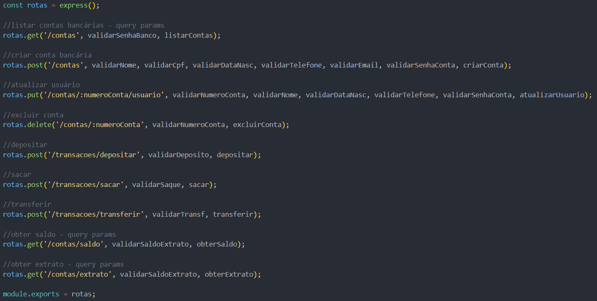
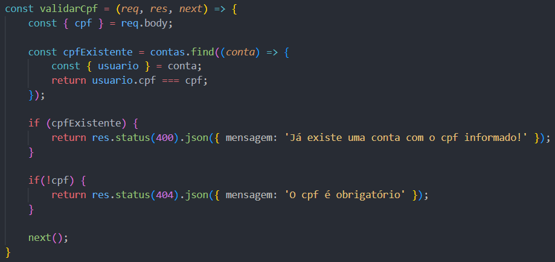
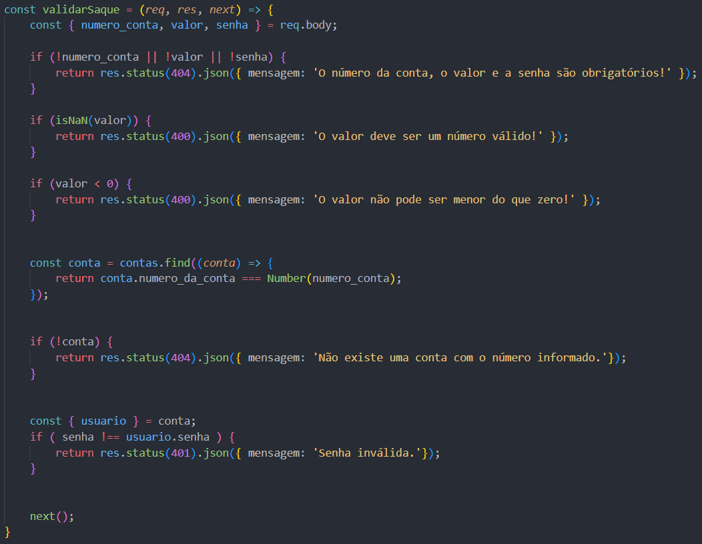
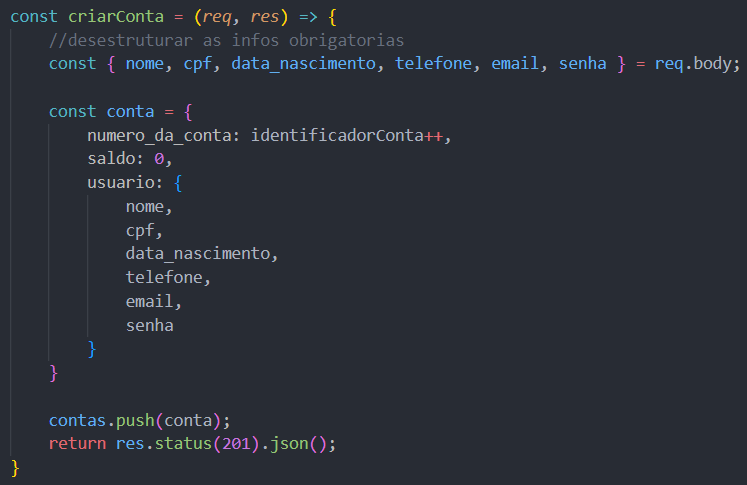
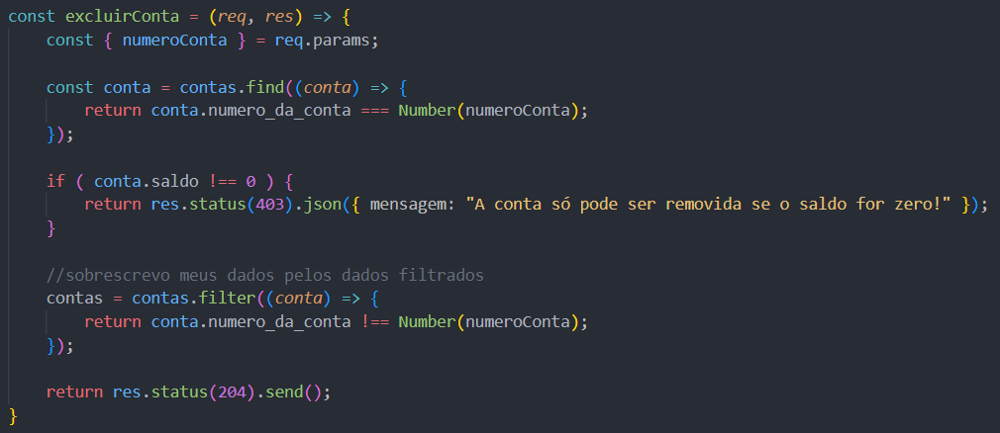
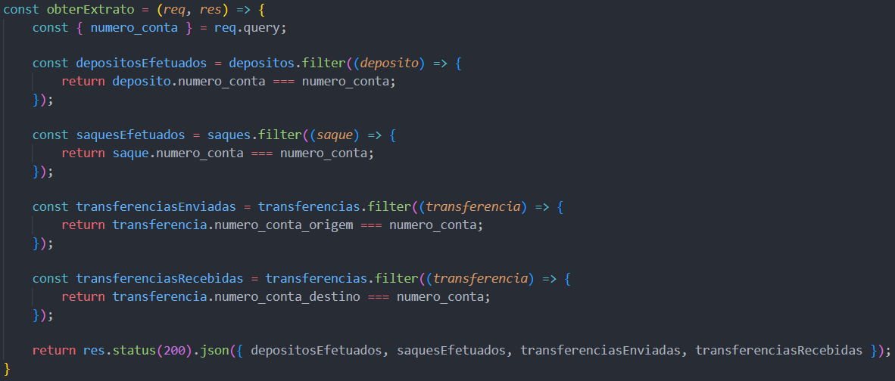
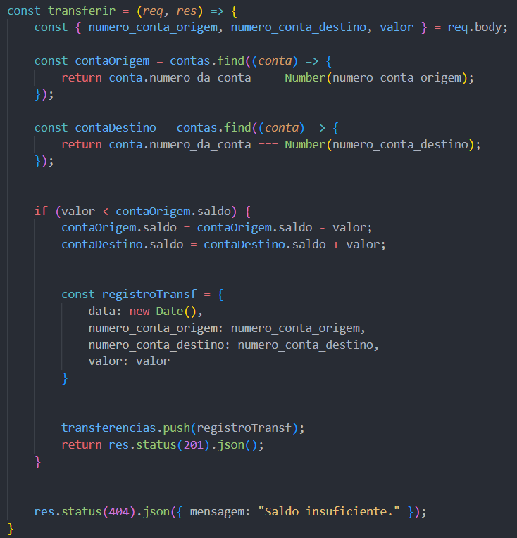

## saveit - easy bank

## 🚀 O start

Esse é meu primeiro projeto criado durante a Formação de Desenvolvimento de Software Back-end, na [Cubos Academy](https://cubos.academy/).
Trata-se de uma API para um Banco Digital fictício, que chamei de saveit, com as seguintes funcionalidades:

-   Criar conta bancária
-   Listar contas bancárias
-   Atualizar os dados do usuário da conta bancária
-   Excluir uma conta bancária
-   Depósitar em uma conta bancária
-   Sacar de uma conta bancária
-   Transferir valores entre contas bancárias
-   Consultar saldo da conta bancária
-   Emitir extrato bancário

## 🎯 Definindo as rotas



```
//listar contas bancárias - query params

rotas.get('/contas', validarSenhaBanco, listarContas);

```

## ⚙️ Incluindo validações





```
Dar exemplos
```

### 🔩 Criando controladores









```
Dar exemplos
```

## 🛠️ Construído com

* [Express](https://www.npmjs.com/package/express) - framework utilizado no desenvolvimento de aplicações web em Node.js, que permite desenvolver de forma organizada, utilizando rotas, middlewares, e requisições e respostas.
* [Insomnia](https://insomnia.rest/) - ferramenta utilizada para testar e desenvolver APIs, simplificando o processo de fazer solicitações HTTP e testar endpoints de APIs durante o desenvolvimento.