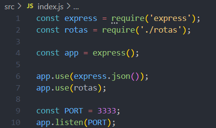
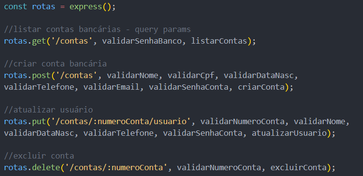
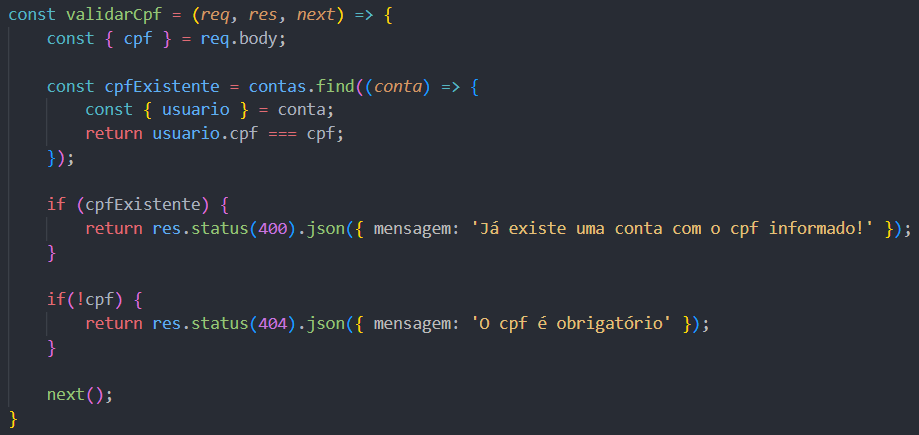
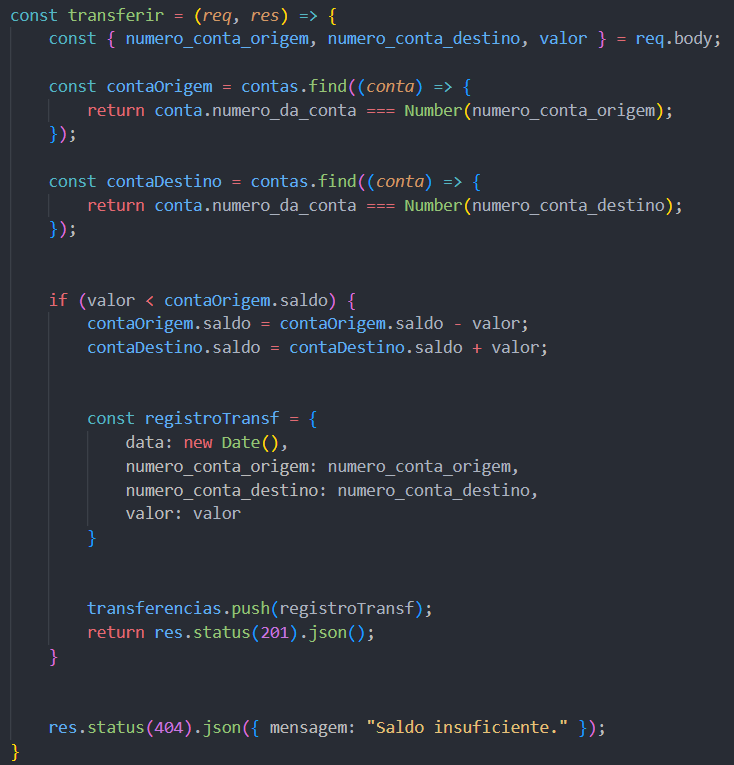

## 🚀 O start

Esse é meu primeiro projeto criado durante a Formação de Desenvolvimento de Software Back-end, na [Cubos Academy](https://cubos.academy/).
Trata-se de uma API para um Banco Digital fictício, que chamei de saveit, com as seguintes funcionalidades:

-   Criar conta bancária
-   Listar contas bancárias
-   Atualizar os dados do usuário da conta bancária
-   Excluir uma conta bancária
-   Depósitar em uma conta bancária
-   Sacar de uma conta bancária
-   Transferir valores entre contas bancárias
-   Consultar saldo da conta bancária
-   Emitir extrato bancário

Foi utilizado o framework Express, que serve para o desenvolvimento de aplicações web em Node.js de forma eficiente e organizada, e a notação JSON, que permite estruturar dados em formato texto para serem utilizados em diferentes tipos de sistemas. É um formato simples, que oferece vários benefícios, como maior velocidade no tráfego em rede e mais agilidade no processamento.



## 🎯 Definindo as rotas

Através das rotas, foi definida cada URL da API, cada uma com sua própria funcionalidade. Utilizando o framework Express, os verbos http utilizados foram Get, Post, Put e Delete. 



```
//rota listar-contas
//http://localhost:3333/contas?senha_banco=Easy123Bank

rotas.get('/contas', validarSenhaBanco, listarContas);
```

## ⚙️ Incluindo validações

Como a API desenvolvida é um sistema bancário, para acessar cada funcionalidade precisamos incluir validações, entre elas conferências de dados e controles de acesso com senhas. Minha estratégia foi utilizar essas validações como Middlewares (ou intermediários), afim de otimizar o código e evitar repetições excessivas. Os Middlewares são informados em cada rota diferente, de acordo com as validações necessárias.



```
//middleware de validação de cpf, um dos utilizados na rota criar-conta
//http://localhost:3333/contas

rotas.post('/contas', validarNome, validarCpf, validarDataNasc, validarTelefone, validarEmail, validarSenhaConta, criarConta);
```

### 🔩 Criando controladores

Os controladores foram organizados e divididos em contas, transacoes, e usuarios. Cada controlador reúne as funções relativas ao seu escopo. Esse tipo de organização facilita a leitura do código de forma geral, pois 'categoriza' as informações.

Em contas, encontram-se as funções: listarContas, criarConta, excluirConta, obterSaldo, e obterExtrato.


Em transacoes, encontram-se as funções: depositar, sacar e transferir.



Em usuarios, encontra-se a função: atualizarUsuario.

```
//trecho da função atualizarUsuario
//http://localhost:3333/contas/1/usuario

    //sobrescreve as propriedades do objeto conta pelas propriedades informadas no body
    usuario.nome = nome;
    usuario.cpf = cpf;
    usuario.data_nascimento = data_nascimento;
    usuario.telefone = telefone;
    usuario.email = email;
    usuario.senha = senha;
```

## 🛠️ Construído com

* [Express](https://www.npmjs.com/package/express) - framework utilizado no desenvolvimento de aplicações web em Node.js, que permite desenvolver de forma organizada, utilizando rotas, middlewares, e requisições e respostas.
* [Insomnia](https://insomnia.rest/) - ferramenta utilizada para testar e desenvolver APIs, simplificando o processo de fazer solicitações HTTP e testar endpoints de APIs durante o desenvolvimento.